# Expense Tracker

A Flutter project that displays and tracks expenses.

## Getting Started

To get started, clone this repository and run the following commands:
flutter pub get
flutter run

This will start the app in your emulator or simulator.

## Features

The Expense Tracker App presents a list of expenses categorized by type, facilitating efficient expense management. Additionally, it generates a visually informative chart illustrating spending patterns across categories, empowering users to make informed financial decisions.

- Themes
- Responsive Design (Mobile/Desktop)
- Dismissible Widget
- ListViewBuilder
- ModalBottomSheet
- SnackBar
- realtime Chartview

## Usage

To use the app, simply tap on the plus icon on the app bar to add expenses.

## Development

The app is developed using Flutter. The code is well-organized and commented.

| Expenses Screen mobile light theme                | Expenses Screen mobile dark theme               |
| ------------------------------------------------- | ----------------------------------------------- |
| 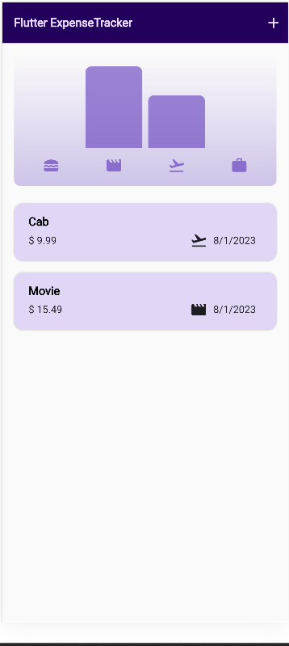 | 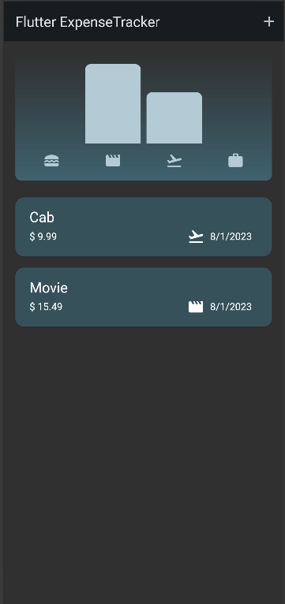 |

| Dismiss expense mobile light theme    | Dismiss expense mobile Dark theme               |
| ------------------------------------- | ----------------------------------------------- |
| 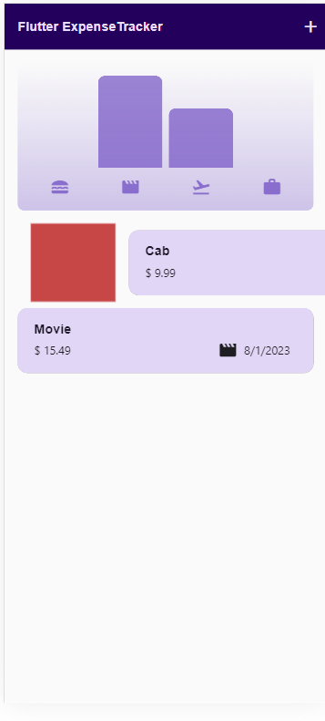 | 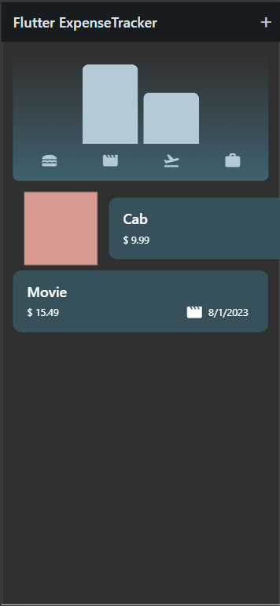 |

| New Expense mobile Screen Light                           | New Expense mobile Screen dark                     |
| --------------------------------------------------------- | -------------------------------------------------- |
| 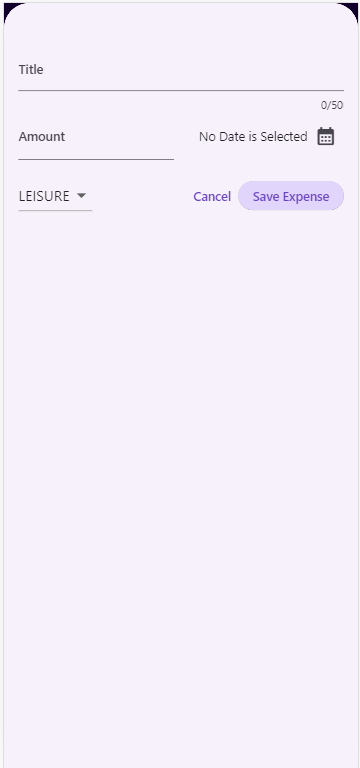 | 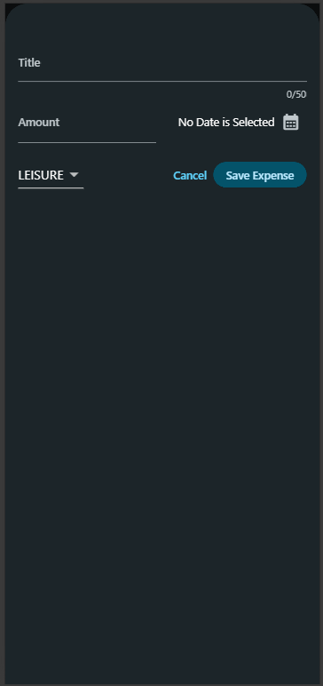 |

| Expense Screen Desktop Dark                          |
| ---------------------------------------------------- |
| 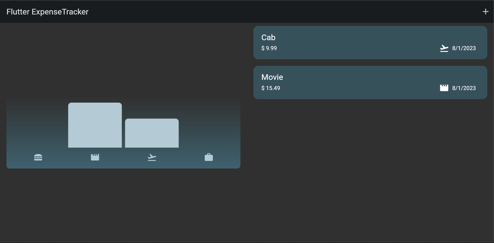 |

| Expense Screen Desktop Light                          |
| ----------------------------------------------------- |
| 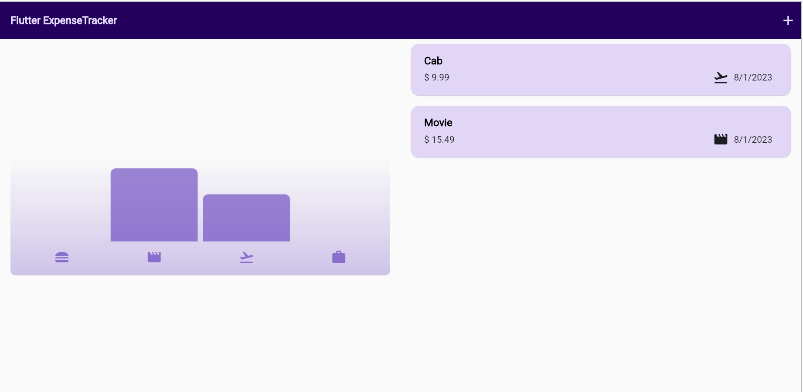 |

| New Expense Screen Desktop Light                          |
| --------------------------------------------------------- |
| 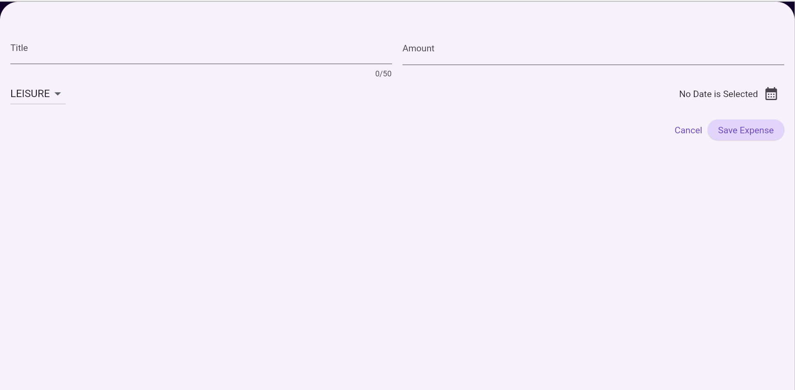 |

| New Expense Screen Desktop Dark                           |
| --------------------------------------------------------- |
| 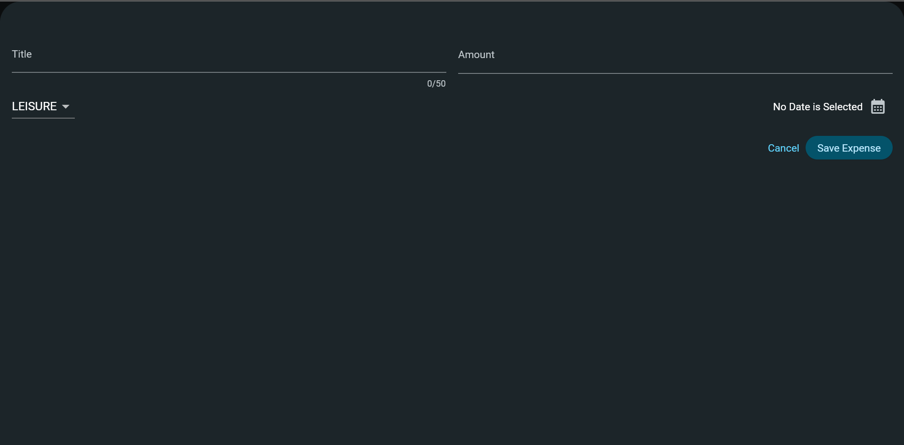 |

| Dismiss expense Desktop Light                       |
| --------------------------------------------------- |
| 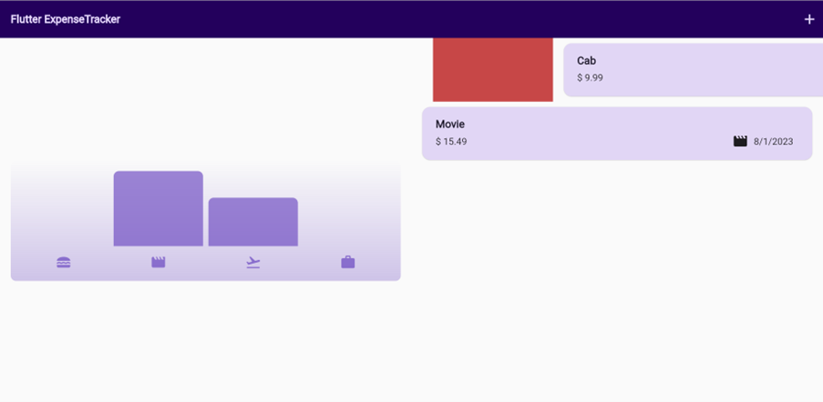 |

| Dismiss expense Desktop Dark                       |
| -------------------------------------------------- |
| 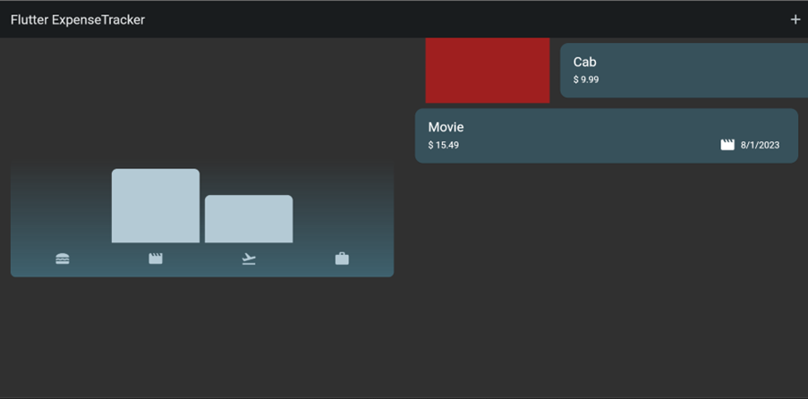 |
